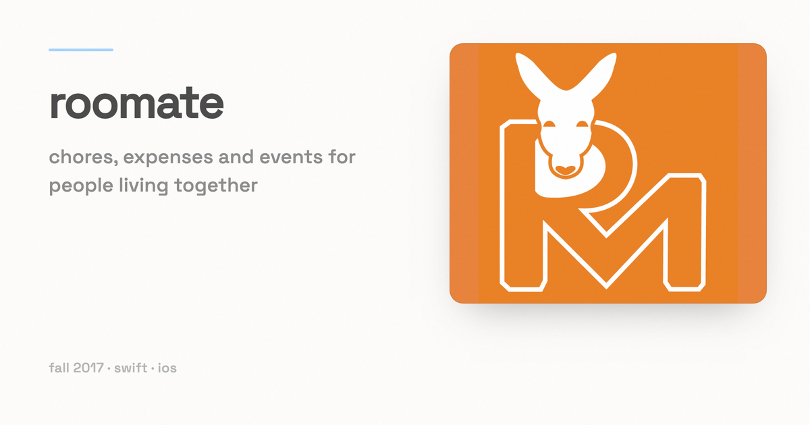

# RooMate

*An app for a house full of roommates: chores, shared expenses, and who actually took the bins out.*

## The idea

I lived with six close friends. Everything that made that hard was a record-keeping problem. Who did the dishes last week, who fronted the internet bill, when rent is due, and who still owes what. RooMate is my answer to that: one app for a household, built around four things.

- A visible history of chore labour, so the work people do is on the record.
- Communal and personal expenses that are easy to split and to keep up to date.
- Simple communication between roommates.
- Events and deadlines in one shared place.

The original RooMate was a group project for CS 506 (Software Engineering) at UW-Madison in 2017. Three other students and I built it as a native iOS app in Swift. That code is not in this repository.

## What is actually in this repository

This is a 2023 rewrite, and it is unfinished. I started it again in Expo and React Native with a Firebase backend and stopped partway through. The last commit (2023-03-17) says it plainly: "basic tab nav, login/signup, create/join/view groups, models need some work for user to actually insert into group."

**Works today**

- Email and password sign-up and log-in through Firebase Auth, with a `LoginScreen` that toggles between the two modes.
- An auth-aware navigator: signed out you get the login stack, signed in you get the tab bar.
- Create a group, which writes a `groups` document to Firestore with a name and a creation timestamp.
- Join a group by its Firestore document id, which appends your uid to the group's `members` array.
- A list of all groups, ordered newest first.

**Does not work yet**

- The data model. Groups are listed globally rather than by membership, and there is no user document tying a person to their groups. This is the "models need some work" from the commit message.
- Every feature the idea is actually about: chores, expenses, messaging, and events. None of them are built here.
- An "Add friends" tab, which is written and commented out in `navigation/MainTabNavigator.tsx`.
- `MainTabNavigator.tsx` imports `react-native-vector-icons`, which is not in `package.json`, so a clean install needs that dependency added.

## Stack

Expo ~48, React Native 0.71, React 18.2, TypeScript, Firebase 9 (Auth and Firestore), React Navigation 6 (a stack for auth, bottom tabs for the app), and React Native Elements (`@rneui`) for the UI.

## Running it

```
yarn install
yarn start
```

Then `yarn ios`, `yarn android`, or `yarn web`, or scan the QR code with Expo Go.

`firebaseConfig.ts` holds a Firebase **web** client config. Those values are public by
design: Firebase ships them in every client bundle, and they identify a project rather
than authorise access. Access is controlled by Firebase Auth and by the project's
Firestore security rules, which are not part of this repository. To point the app at
your own project, replace the object in `firebaseConfig.ts`.

## Layout

- `App.tsx` — wraps the app in `AuthProvider` and the safe-area provider.
- `AuthProvider.tsx` — Firebase auth state as React context, plus a `useAuth` hook.
- `firebaseConfig.ts` — Firebase app, auth, and Firestore instances.
- `navigation/` — `AppNavigator.tsx` picks login or app based on auth state; `MainTabNavigator.tsx` is the bottom tab bar.
- `components/` — `LoginScreen`, `CreateGroup`, `JoinGroup`, `GroupList`.
- `theme.ts` — the `@rneui` colour theme.

## Licence

MIT. See [LICENSE](LICENSE).
